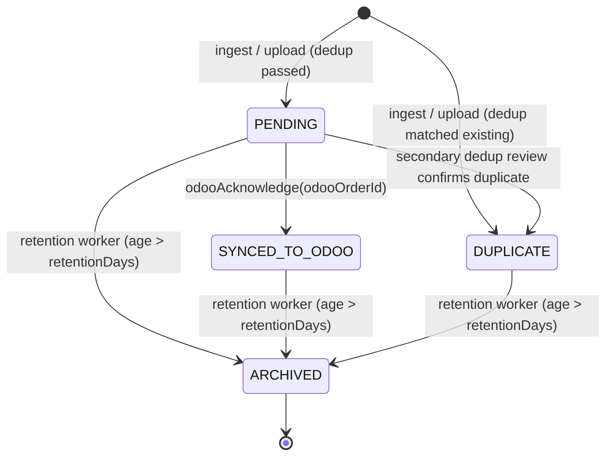
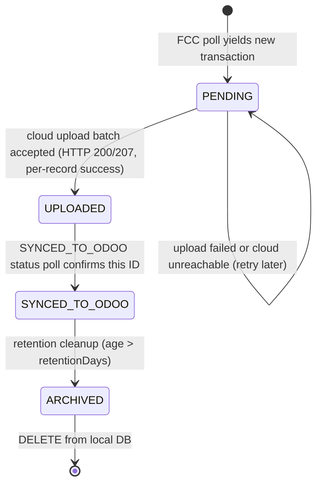
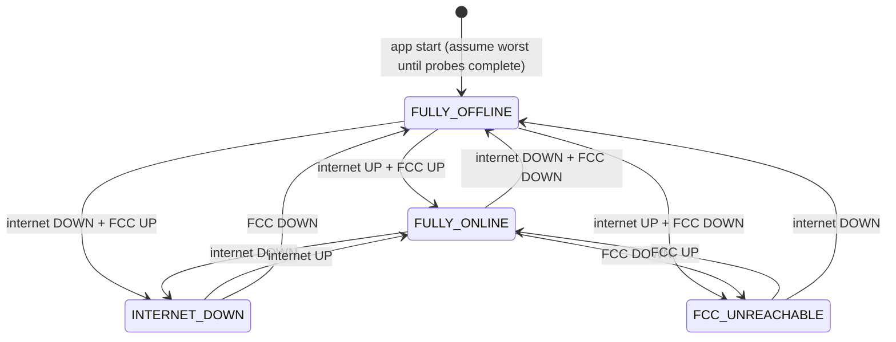
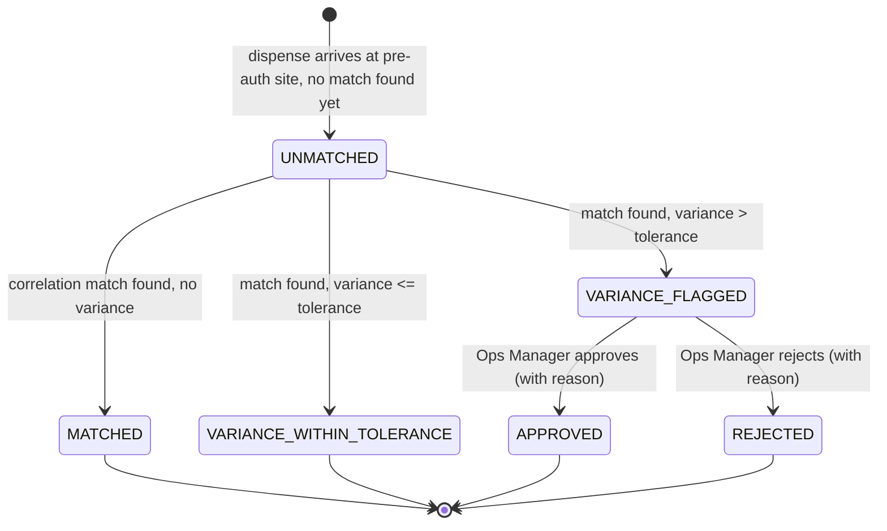

# Tier 1.2 — State Machine Formal Definitions

## 1. Output Location

- **Target file:** `docs/specs/state-machines/tier-1-2-state-machine-formal-definitions.md`
- **Why:** `docs/STRUCTURE.md` maps state machine definitions to `/docs/specs/state-machines`. This is the single authoritative artefact for TODO 1.2.

## 2. Scope

- **TODO item:** 1.2 State Machine Formal Definitions
- **In scope:** Transaction Lifecycle, Pre-Auth Lifecycle (reference + gap closure), Edge Sync Record State, Connectivity State Machine, Reconciliation State, Mermaid diagrams for all five machines
- **Out of scope:** Implementation classes, database DDL, API endpoint behaviour, event payloads

## 3. Source Traceability

- **Requirements:** REQ-6 (pre-auth), REQ-7 (normal orders), REQ-8 (reconciliation), REQ-9 (Odoo order creation), REQ-12 (deduplication), REQ-15 (edge agent)
- **HLD sections:** Cloud Backend §4.3 (Ingestion, Pre-Auth, Reconciliation, Odoo Sync modules), Edge Agent §3.2 (operating modes), §4 (sync flows)
- **Prerequisite artefacts:** Tier 1.1 canonical transaction spec (TransactionStatus enum), Tier 1.1 pre-auth record spec (PreAuthStatus enum + state machine)
- **Assumption:** Pre-Auth state machine in `tier-1-1-pre-auth-record-spec.md` is authoritative. This artefact references it and closes one gap (DISPENSING timeout side-effect).

## 4. Key Decisions

| # | Decision | Why | Impact |
|---|----------|-----|--------|
| D1 | `STALE_PENDING` is a **flag, not a state transition** — the transaction remains `PENDING` with `isStale = true` | Avoids a state that blocks normal Odoo acknowledgement if the stale alert fires just before Odoo polls | Cloud schema adds `isStale` boolean; no separate status value needed in the state machine |
| D2 | Edge Sync Record uses a separate `SyncStatus` enum distinct from cloud `TransactionStatus` | Edge and cloud lifecycles are independent; conflating them creates ambiguity when edge is UPLOADED but cloud is still PENDING | Edge Agent Room entity uses `SyncStatus`; cloud uses `TransactionStatus` |
| D3 | Reconciliation adds `APPROVED` and `REJECTED` as terminal states after Ops Manager review | Portal HLD §3.1 defines approve/reject actions on VARIANCE_FLAGGED items; these need formal states | Cloud schema, portal workbench, and event publishing all use the extended enum |
| D4 | Connectivity state transitions are driven by two independent probes: cloud health ping and FCC heartbeat | Separating probes avoids coupling internet detection to FCC reachability | ConnectivityManager runs two independent checks on fixed intervals |

---

## 5. Detailed Specification

### 5.1 Transaction Lifecycle (Cloud)

The cloud-side transaction status tracks a record from ingestion to archival.

**Transition table:**

| From | To | Trigger | Guard | Side Effects |
|------|----|---------|-------|--------------|
| *(new)* | `PENDING` | Transaction ingested via push, pull, or edge upload | Dedup check passes (no existing `fccTransactionId + siteCode`) | Persist canonical record; publish `TransactionIngested` event; archive raw payload to S3 |
| *(new)* | `DUPLICATE` | Transaction ingested but dedup matches existing record | `fccTransactionId + siteCode` already exists | Set `isDuplicate = true`, `duplicateOfId` = original record ID; publish `TransactionDeduplicated` event; do NOT serve to Odoo |
| `PENDING` | `SYNCED_TO_ODOO` | Odoo calls acknowledge API with `odooOrderId` | Transaction exists and status is `PENDING` | Set `odooOrderId`, `syncedToOdooAt`; publish `TransactionSyncedToOdoo` event |
| `PENDING` | `DUPLICATE` | Ops review or secondary dedup confirms duplicate | Manual or automated review decision | Set `isDuplicate = true`, `duplicateOfId`; publish `TransactionDeduplicated` event |
| `PENDING` | `ARCHIVED` | Retention worker | `createdAt + retentionDays < now` AND status still `PENDING` | Move to archive storage; set `archivedAt` |
| `SYNCED_TO_ODOO` | `ARCHIVED` | Retention worker | `syncedToOdooAt + retentionDays < now` | Move to archive storage; set `archivedAt` |
| `DUPLICATE` | `ARCHIVED` | Retention worker | `createdAt + retentionDays < now` | Move to archive storage; set `archivedAt` |

**Stale detection (not a transition):** A background worker sets `isStale = true` on PENDING transactions where `createdAt + stalePendingThresholdDays < now`. This raises an alert but does NOT change `status`. Odoo can still acknowledge a stale-flagged transaction normally.

**Invalid transitions:** Any transition not listed above must throw `InvalidTransactionTransitionException` and log a warning. Transitions backward (e.g., SYNCED_TO_ODOO → PENDING) are never valid.

**Note on `SYNCED` status:** The `SYNCED` value in `TransactionStatus` is **not used on the cloud side**. It exists only for edge-to-cloud protocol semantics (the edge upload response marks records as received). On cloud, a successfully uploaded transaction is `PENDING`. See §5.3 for edge-side usage.

---

### 5.2 Pre-Auth Lifecycle

The authoritative definition is in `docs/specs/data-models/tier-1-1-pre-auth-record-spec.md` §5.2. That artefact defines all states, transitions, guards, side effects, and the Mermaid diagram.

**Summary of states:** `PENDING` → `AUTHORIZED` → `DISPENSING` (optional) → `COMPLETED` | `CANCELLED` | `EXPIRED` | `FAILED`

**Gap closure — DISPENSING → EXPIRED side effect:** When a DISPENSING pre-auth expires, the system must attempt FCC pump deauthorization (same as AUTHORIZED → EXPIRED). The tier-1-1 spec lists this for PENDING → EXPIRED and AUTHORIZED → EXPIRED but omits the explicit FCC deauthorization attempt for DISPENSING → EXPIRED. **This artefact clarifies:** DISPENSING → EXPIRED must also attempt `fccDeauthorizePump(pumpNumber)` as a best-effort side effect.

**No other changes** to the pre-auth state machine defined in tier-1-1.

---

### 5.3 Edge Sync Record State Machine

Each transaction record on the Edge Agent has an independent `SyncStatus` tracking its progression toward cloud confirmation.

**Transition table:**

| From | To | Trigger | Guard | Side Effects |
|------|----|---------|-------|--------------|
| *(new)* | `PENDING` | FCC adapter produces a normalized transaction from LAN poll | Dedup: no existing record with same `fccTransactionId` in local DB | Insert into Room `BufferedTransaction` table; increment buffer depth counter |
| `PENDING` | `UPLOADED` | Cloud upload API returns per-record success (HTTP 200/207, record status = `created` or `skipped`) | Upload batch completed without transport error for this record | Set `uploadedAt`; if cloud returned `skipped` (dedup), still mark UPLOADED locally |
| `UPLOADED` | `SYNCED_TO_ODOO` | SYNCED_TO_ODOO status poll returns this transaction's `fccTransactionId` | Record exists locally with status `UPLOADED` | Set `syncedToOdooAt`; exclude from local API GET responses |
| `SYNCED_TO_ODOO` | `ARCHIVED` | Retention cleanup worker | `syncedToOdooAt + retentionDays < now` (default: 7 days) | No-op marker; record eligible for DELETE |
| `ARCHIVED` | *(deleted)* | Cleanup worker DELETE pass | Status = `ARCHIVED` | DELETE from Room table; decrement buffer depth counter |

**Replay ordering:** PENDING records are uploaded in chronological order (`createdAt ASC`). The upload worker never skips ahead past a failed record — it retries the oldest PENDING batch first.

**Local API visibility:** `GET /api/transactions` returns records with `SyncStatus` in (`PENDING`, `UPLOADED`). Records at `SYNCED_TO_ODOO` or `ARCHIVED` are excluded to prevent Odoo POS double-consumption.

**Edge-only dedup on insert:** Before inserting a new PENDING record, check `fccTransactionId` uniqueness in local DB. If exists at any status, skip silently (FCC poll may return the same transaction twice).

---

### 5.4 Connectivity State Machine

The Edge Agent maintains a connectivity state derived from two independent probes.

**Probe definitions:**

| Probe | Target | Interval | Method | UP condition | DOWN condition |
|-------|--------|----------|--------|--------------|----------------|
| Internet | Cloud `GET /health` | 30 seconds (configurable) | HTTP GET, 5s timeout | HTTP 200 within timeout | Timeout, connection refused, or non-200 response. 3 consecutive failures required to transition to DOWN. |
| FCC | FCC heartbeat endpoint (vendor-specific) | 30 seconds (configurable) | Adapter `heartbeat()`, 5s timeout | Adapter returns `true` | Adapter returns `false` or throws. 3 consecutive failures required to transition to DOWN. |

**Recovery (UP):** A single successful probe response transitions the probe back to UP immediately (no consecutive-success requirement).

**State derivation:**

| Internet Probe | FCC Probe | Connectivity State |
|----------------|-----------|--------------------|
| UP | UP | `FULLY_ONLINE` |
| DOWN | UP | `INTERNET_DOWN` |
| UP | DOWN | `FCC_UNREACHABLE` |
| DOWN | DOWN | `FULLY_OFFLINE` |

**Module behaviour per state:**

| Module | FULLY_ONLINE | INTERNET_DOWN | FCC_UNREACHABLE | FULLY_OFFLINE |
|--------|-------------|---------------|-----------------|---------------|
| FCC Poller | Polls on schedule | Polls on schedule | **Suspended** — logs warning each skipped cycle | **Suspended** |
| Pre-Auth Handler | Sends to FCC over LAN; queues to cloud async | Sends to FCC over LAN; queues to cloud (retries later) | **Rejects** with `FCC_UNREACHABLE` error to Odoo POS | **Rejects** with `FCC_UNREACHABLE` error |
| Cloud Upload Worker | Uploads PENDING batches | **Suspended** — resumes on recovery | Uploads PENDING batches (internet is up) | **Suspended** |
| SYNCED_TO_ODOO Poller | Polls cloud on schedule | **Suspended** | Polls cloud on schedule | **Suspended** |
| Config Poller | Polls cloud on schedule | **Suspended** — uses last-known config | Polls cloud on schedule | **Suspended** — uses last-known config |
| Telemetry Reporter | Reports on schedule | **Suspended** — skips (no buffering) | Reports on schedule | **Suspended** |
| Local REST API | Serves requests (excludes SYNCED_TO_ODOO records) | Serves requests (full buffer visible) | Serves requests | Serves requests (stale buffer) |

**Side effects on transition:**

| Transition | Side Effect |
|------------|-------------|
| Any → `INTERNET_DOWN` | Log audit event; increment `internetDownCount` in telemetry; Cloud Upload Worker stops |
| Any → `FCC_UNREACHABLE` | Log audit event; alert Site Supervisor via diagnostics screen; FCC Poller stops |
| Any → `FULLY_OFFLINE` | Log audit event; all cloud and FCC workers stop; local API continues |
| Any → `FULLY_ONLINE` | Log audit event; Cloud Upload Worker triggers immediate replay of PENDING buffer; SYNCED_TO_ODOO Poller triggers immediate poll; Telemetry Reporter sends accumulated metrics |
| `INTERNET_DOWN` → `FULLY_ONLINE` | Replay Worker activates — uploads all PENDING records in chronological order |
| `FCC_UNREACHABLE` → `FULLY_ONLINE` | FCC Poller resumes; first poll uses last-known cursor |

**Startup:** The agent initializes in `FULLY_OFFLINE` and runs both probes immediately. State is derived from probe results within the first 10 seconds.

---

### 5.5 Reconciliation State Machine

Reconciliation status tracks whether a dispense transaction at a pre-auth site has been matched to its originating pre-auth and whether any variance has been reviewed.

**Transition table:**

| From | To | Trigger | Guard | Side Effects |
|------|----|---------|-------|--------------|
| *(new)* | `UNMATCHED` | Dispense transaction ingested at a pre-auth site | No matching pre-auth found by correlation engine on initial attempt | Create reconciliation record with `status = UNMATCHED`; publish `ReconciliationUnmatched` event; transaction is still stored as `PENDING` for Odoo |
| `UNMATCHED` | `MATCHED` | Matching engine finds pre-auth via correlation ID, pump+nozzle+time window, or `odooOrderId` | `abs(actualAmount - requestedAmount) == 0` (exact match) | Link reconciliation record to pre-auth; set `matchedAt`; transition pre-auth to `COMPLETED`; publish `ReconciliationMatched` event |
| `UNMATCHED` | `VARIANCE_WITHIN_TOLERANCE` | Matching engine finds pre-auth | `0 < abs(variance) <= toleranceThreshold` | Same as MATCHED plus set `variance`, `varianceBps`; publish `ReconciliationMatched` event |
| `UNMATCHED` | `VARIANCE_FLAGGED` | Matching engine finds pre-auth | `abs(variance) > toleranceThreshold` | Same as MATCHED plus set `variance`, `varianceBps`; publish `ReconciliationVarianceFlagged` event; create portal notification for Ops Manager |
| `VARIANCE_FLAGGED` | `APPROVED` | Ops Manager clicks Approve in portal | Reason text provided | Set `reviewedBy`, `reviewedAt`, `reviewReason`; publish `ReconciliationApproved` event |
| `VARIANCE_FLAGGED` | `REJECTED` | Ops Manager clicks Reject in portal | Reason text provided | Set `reviewedBy`, `reviewedAt`, `reviewReason`; publish `ReconciliationRejected` event; trigger investigation workflow (TBD in Tier 2.3) |

**Immediate matching:** When a dispense transaction arrives, the matching engine runs synchronously during ingestion. If a match is found, the record transitions directly to `MATCHED`, `VARIANCE_WITHIN_TOLERANCE`, or `VARIANCE_FLAGGED` — it never passes through `UNMATCHED`. The `UNMATCHED` state is only set when no match is found on the initial attempt.

**Deferred matching:** An `UnmatchedReconciliationWorker` periodically re-attempts matching for `UNMATCHED` records (e.g., every 5 minutes for the first hour, then hourly for 24 hours). After 24 hours with no match, the record remains `UNMATCHED` permanently and requires manual investigation.

**Terminal states:** `MATCHED`, `VARIANCE_WITHIN_TOLERANCE`, `APPROVED`, `REJECTED`. No further transitions from these states.

**Scope:** Reconciliation only applies to transactions at sites where `siteUsesPreAuth = true`. Transactions at non-pre-auth sites have `reconciliationStatus = null`.

**Tolerance configuration:** `toleranceThreshold` is configurable per legal entity (default: 200 basis points / 2%). Defined in site config. Tolerance is applied to amount only (`abs(actualAmount - requestedAmount) / requestedAmount * 10000 > toleranceBps`).

---

## 6. Validation and Edge Cases

| Case | Handling |
|------|----------|
| Odoo acknowledges a transaction that is already `SYNCED_TO_ODOO` | Idempotent — return success, no state change |
| Odoo acknowledges a `DUPLICATE` transaction | Reject with `409 Conflict` — duplicates are not served to Odoo |
| Edge upload contains a transaction already at `UPLOADED` or later | Idempotent — return `skipped` in per-record response |
| FCC and internet probes both fail simultaneously on startup | Agent starts in `FULLY_OFFLINE`; retries on next probe interval |
| Pre-auth match arrives before the pre-auth record reaches cloud | Dispense stored as `UNMATCHED`; deferred matching worker picks it up when pre-auth record arrives |
| Ops Manager attempts to approve an `UNMATCHED` record | Invalid — only `VARIANCE_FLAGGED` records can be approved/rejected |
| Connectivity flaps rapidly (probe alternates UP/DOWN) | 3-consecutive-failure threshold for DOWN prevents flapping; single-success recovery is intentional (fail slow, recover fast) |
| Edge Agent restarts mid-upload batch | On restart, re-scan for `PENDING` records and resume upload from oldest; cloud dedup handles any re-sent records |

## 7. Cross-Component Impact

| Component | Impact |
|-----------|--------|
| **Cloud Backend** | Implement Transaction state machine enforcement in domain layer; add `isStale` flag to transaction entity; add `APPROVED`/`REJECTED` to `ReconciliationStatus` enum; implement `UnmatchedReconciliationWorker` |
| **Edge Agent** | Implement `SyncStatus` enum (distinct from cloud `TransactionStatus`); implement `ConnectivityManager` with dual-probe logic and 3-failure threshold; enforce replay ordering |
| **Angular Portal** | Reconciliation workbench approve/reject actions write to `APPROVED`/`REJECTED` states; display connectivity state per agent on monitoring dashboard |
| **Shared Enums** | `ReconciliationStatus` gains `APPROVED` and `REJECTED` values vs the tier-1-1 definition; `SyncStatus` is a new Edge-only enum |

## 8. Dependencies

- **Prerequisites:** Tier 1.1 canonical data model (provides base enum values and pre-auth state machine)
- **Downstream:** Tier 1.3 API contracts (upload response schema must support per-record `created`/`skipped`), Tier 1.4 database schema (columns for `isStale`, `reviewedBy`, `reviewedAt`, `reviewReason`), Tier 2.1 error handling (invalid transition error codes), Tier 2.3 reconciliation rules engine (matching algorithm, tolerance config structure, deferred matching schedule)
- **Recommended next step:** Update tier-1-1 `ReconciliationStatus` enum to include `APPROVED` and `REJECTED`; then proceed to Tier 1.3 API contracts

## 9. Open Questions

| # | Question | Recommendation | Risk if Deferred |
|---|----------|----------------|------------------|
| OQ-1 | Should `UNMATCHED` records be automatically escalated after 24 hours, or just left for manual review? | Auto-escalate: create portal alert after 24h unmatched. Do not auto-reject. | Low — does not affect schema or state machine; only affects worker behaviour |
| OQ-2 | Should the `REJECTED` reconciliation state trigger a compensating action (e.g., block Odoo order creation)? | No — the transaction is already PENDING for Odoo regardless of reconciliation outcome (per BR-8.4). Rejection is audit-only. | Medium — if rejection should block Odoo, the transaction lifecycle needs a new guard |

## 10. Acceptance Checklist

- [ ] Transaction Lifecycle: all 6 status values defined with transitions, guards, and side effects
- [ ] Stale detection documented as a flag, not a state transition
- [ ] Pre-Auth Lifecycle: gap closure (DISPENSING → EXPIRED side effect) documented; tier-1-1 referenced as authoritative
- [ ] Edge Sync Record: `SyncStatus` enum defined with 4 states; transitions, local API visibility rules, and replay ordering documented
- [ ] Connectivity State Machine: 4 states, dual-probe derivation, 3-failure DOWN threshold, module behaviour table per state, transition side effects
- [ ] Reconciliation State: 6 states including APPROVED/REJECTED; transition table with triggers and guards; deferred matching worker described; tolerance config referenced
- [ ] Mermaid diagrams provided for all 5 state machines
- [ ] Invalid transition handling specified for each machine
- [ ] No duplicate content between this artefact and tier-1-1 specs
- [ ] `ReconciliationStatus` enum update (add APPROVED, REJECTED) identified as required change to tier-1-1

## 11. Output Files to Create

| File | Purpose |
|------|---------|
| `docs/specs/state-machines/tier-1-2-state-machine-formal-definitions.md` | This artefact — all five state machines |

No machine-readable companion needed. Mermaid diagrams are embedded and renderable from markdown.

## 12. Recommended Next TODO

**Tier 1.1 — Shared Enums** (the `[ ]` sub-items under 1.1) should be completed next, incorporating the `SyncStatus` enum defined here and the extended `ReconciliationStatus`. After that, proceed to **Tier 1.3 — API Contract Specifications**.
